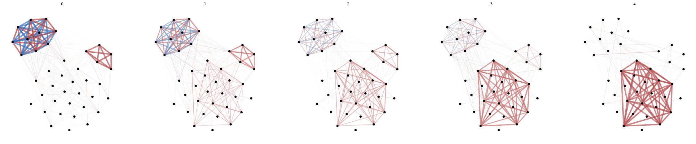
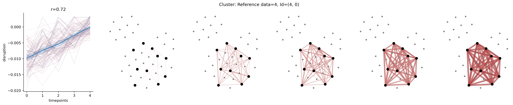
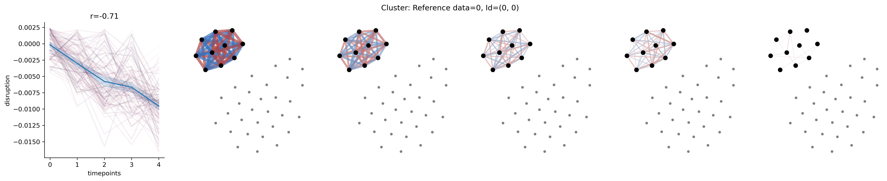
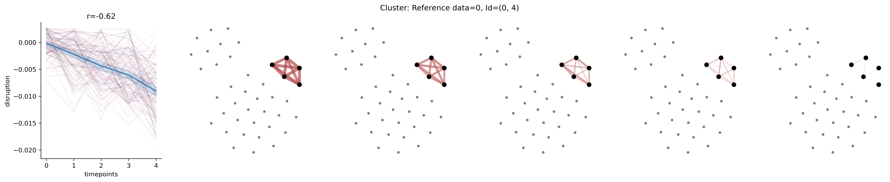

# *NeDis*: Network-based disruption analysis of biological coordination

**Motivation.** Biological systems comprise a vast amount of intricate processes that are deeply interconnected and carefully coordinated.
These systems must adapt to stimuli and challenge – often through dynamic functional changes in how the corresponding processes
interact. However, the associated complex disruption patterns are hard to capture, particularly when analyzing large amounts of measured
biomarkers and focusing on individual markers without accounting for their dependencies.

**Results.** To address this, we provide CoDi , an easy to use and highly customizable open-source package that allows to capture disruption
properties of biomarker networks across conditions and timepoints, and discover modules with exceptional disruption profiles. CoDi
employs the notion of correlation disruption which quantifies functional disruptions and enables a novel perspective on the coordination
and adaption of biological systems to stimuli and challenge. Our examples illustrate the scope of CoDi , by revealing coordinated functional
adaptions of the immune system during pregnancy

## Quickstart


```bash
# create an environment for `NeDis`
# newer versions of Python should also work (e.g., 3.14.3)
conda env create --name nedis python=3.9.10 
conda activate nedis

# EITHER: install CoDi directly from GitHub
pip install https://github.com/bckrlab/nedis.git

# OR: install from source
git clone https://github.com/bckrlab/nedis.git
cd nedis
pip install -e .
```

To quickly jump into playing with `CoDi`, quickly install JupyterLab and run it:

```bash
pip install jupyterlab
jupyter lab
```

By default a browser should open at `http://localhost:8080` where you can play with the notebooks in the `notebooks` folder. For example, you can find this README as a notebook: `notebooks/README.ipynb`.

## Examples

### Load example data


```python
random_state = 43
```


```python
# helps with CPU oversubscription and slowing down t-SNE
# needs to be set before importing any of the libraries that use threads (e.g. numpy, scikit-learn)
from nedis.parallelization import set_threads_for_external_libraries
set_threads_for_external_libraries(4) 
```


```python
from nedis.data.synthetic import load_example
from nedis.visualization import visualize_data
```


```python
# load data
X, y, entities, labels = load_example(random_state=random_state)

# visualize
fig, axes, correlation_matrices, coordinates = visualize_data(
    X, y, entities, mode="network", random_state=random_state);
```


    

    


### Configure and fit correlation disruption


```python
from nedis.cordis.default \
    import DefaultCorrelationDisruptionFeatureTransformer \
    as DefaultCorrelationDisruptionTransformer
```


```python
# configure and fir correlation disruption transformer
disruption_transformer = DefaultCorrelationDisruptionTransformer(
    default_optimization_separation_score="spearman",
    default_derive_features_aggregation="mean",
    default_clustering_random_state=44)
disruption_transformer.fit(X, y, groups=entities, subset_masks="y");
```


```python
# transform samples
disruption_values = disruption_transformer.transform(X)
```


```python
# we get one aggregated disruption value per cluster for each sample
disruption_values.shape
```


    (500, 3)


### Visualize disrupted modules


```python
import numpy as np
import scipy.stats

import matplotlib.pyplot as plt
import seaborn as sns

from nedis.visualization import plot_cordis_cluster as plot_cluster
```


```python
y_unique = np.unique(y)

for i_cluster, cluster in enumerate(disruption_transformer.selected_clusters_):
    
    values = disruption_values[:, i_cluster]
    r, p = scipy.stats.spearmanr(values, y)
    
    fig, axes = plt.subplots(
        1, len(y_unique) + 1, 
        figsize=(4 * 1 * (len(y_unique) + 1), 4 * 1), 
        dpi=300)
 
    # correlation disruption plot
    ax = axes[0]
    x_rank = scipy.stats.rankdata(y, method="dense")
    sns.lineplot(x=x_rank, y=values, hue=entities, color="blue", alpha=0.1, ax=ax)
    sns.lineplot(x=x_rank, y=values, ax=ax)
    ax.set(
        xlabel="timepoints",
        xticks=np.unique(x_rank),
        xticklabels= y_unique,
        ylabel="disruption",
        title=f"r={r:.02f}"
    )
    ax.get_legend().remove()
    ax.spines['right'].set_visible(False)
    ax.spines['top'].set_visible(False)
    
    # cluster visualization
    for i, yy in enumerate(y_unique):
        ax = axes[i + 1]
        ax.axis("off")
        plot_cluster(
            cluster, 
            coordinates, 
            correlation_matrices[yy], 
            correlation_threshold=0, 
            verbose=0,
            ax=ax)
    fig.suptitle(
        f"Cluster: Reference data={cluster['reference_label']}, Id={cluster['id']}")
    
    plt.show()
```


    

    


    

    


    

    


## Advanced usage

`DefaultCorrelationDisruptionFeatureTransformer` used above is a simplified wrapper for `CorrelationDisruption`.
`CorrelationDisruption` has three main important steps that need to be configured:

- the clustering step (`cluster_step`)
- the optimization step (`optimization_step`)
- and the filtering behavior (`filter_coverage_threshold` and `separation_score_threshold`)


```python
from nedis.cluster.leidenalg import WeightedLeidenClustering
from nedis.cordis.clustering import ReferenceCorrelationMatrixClusteringStep
from nedis.cordis.optimization import GreedyRefinementOptimizationStep
from nedis.cordis.disruption import CorrelationDisruption
```

### Default behavior


```python
# NOTE: you can use any cluster algorithm that assigns a cluster label to each feature
clustering_algorithm = WeightedLeidenClustering(random_state=random_state)

clustering_step = ReferenceCorrelationMatrixClusteringStep(
    clustering_algorithm=clustering_algorithm,
#     clustering_absolute_correlation=True,
#     correlation_function="spearman",
#     feature_filters=None
)

optimization_step = GreedyRefinementOptimizationStep(
    separation_score="spearman",
#     separation_score_comparison='all',
#     refinement_mode="rows-and-columns",
#     correlation_function="spearman",
#     disruption_metric="direction",
#     disruption_robustness='loo',
#     disruption_aggregation='mean',
#     max_runs=-1
)

codi = CorrelationDisruption(
    clustering_step=clustering_step,
    cluster_optimization_step=optimization_step,
    # filtering
    filter_coverage_threshold=0.5, 
    separation_score_threshold=("auto", 1)
)
codi.fit(X, y, subset_masks="y")
```


    CorrelationDisruption(cluster_optimization_step=<nalabcordis.cordis.optimization.GreedyRefinementOptimizationStep object at 0x7f9cc878a910>,
                          clustering_step=ReferenceCorrelationMatrixClusteringStep(clustering_algorithm=WeightedLeidenClustering(random_state=43)),
                          filter_coverage_threshold=0.5,
                          separation_score_threshold=('auto', 1))


### Knowledge-defined clustering

This is an example of customization 
that allows to introduce knowledge-defined clustering and skip the optimization step, 
i.e., clustering pre-defined by the user rather than using a clustering algorithm.


```python
from nedis.cordis.clustering import (
    ListClusteringStep, ReferenceFeatureLabelClusteringStep, init_cluster)
from nedis.cordis.optimization import (
    ReferenceScoreOptimizationStep)
```


```python
# use to define clusters by feature labels
# `labels` is defined in the data creation above
clustering_step = ReferenceFeatureLabelClusteringStep(labels)

# # ALTERNATIVE: completely custom clusters
# clustering_step = ListClusteringStep([
#     init_cluster(reference_label=0, reference_shape=X.shape[1], rows=np.arange(0,5)),
#     init_cluster(reference_label=4, reference_shape=X.shape[1], rows=np.arange(5,15)),
#     init_cluster(reference_label=0, reference_shape=X.shape[1], rows=np.arange(15,25)),
# ])

# use this to prevent optimization 
# ALTERNATIVE: use the GreedyRefinementOptimizationStep from above
optimization_step = ReferenceScoreOptimizationStep(
    separation_score="spearman",
)

codi = CorrelationDisruption(
    clustering_step=clustering_step,
    cluster_optimization_step=optimization_step,
    # filtering
    filter_coverage_threshold=0.5, 
    separation_score_threshold=("auto", 1)
)
codi.fit(X, y, subset_masks="y")
```


    CorrelationDisruption(cluster_optimization_step=<nalabcordis.cordis.optimization.ReferenceScoreOptimizationStep object at 0x7f9cc878a7c0>,
                          clustering_step=ReferenceFeatureLabelClusteringStep(feature_labels=array([ 0,  0,  0,  0,  0,  1,  1,  1,  1,  1,  1,  1,  1,  1,  1,  2,  2,
            2,  2,  2,  2,  2,  2,  2,  2, -1, -1, -1, -1, -1, -1, -1, -1, -1,
           -1, -1, -1, -1, -1, -1])),
                          filter_coverage_threshold=0.5,
                          separation_score_threshold=('auto', 1))


### Stabilizing clustering

Clustering of modules can be quite unstable, particularly for small datasets in combination with the underlying `Leidenalg` algorithm. To alleviate this, we recommend using bootstrapping (`n=1000`) in combination with consensus-based clustering as illustrated below by using `BootstrappedReferenceCorrelationMatrixClusteringStep`:


```python
from nedis.cordis.clustering import (
    BootstrappedReferenceCorrelationMatrixClusteringStep)


# NOTE: you can use any cluster algorithm that assigns a cluster label to each feature
clustering_algorithm = WeightedLeidenClustering(random_state=random_state)

clustering_step = BootstrappedReferenceCorrelationMatrixClusteringStep(
    clustering_algorithm=clustering_algorithm,
#     clustering_absolute_correlation=True,
#     correlation_function="spearman",
#     feature_filters=None
    bootstrap_iterations=1000,
    bootstrap_stability_threshold=-1,
)

optimization_step = GreedyRefinementOptimizationStep(
    separation_score="spearman",
#     separation_score_comparison='all',
#     refinement_mode="rows-and-columns",
#     correlation_function="spearman",
#     disruption_metric="direction",
#     disruption_robustness='loo',
#     disruption_aggregation='mean',
#     max_runs=-1
)

codi = CorrelationDisruption(
    clustering_step=clustering_step,
    cluster_optimization_step=optimization_step,
    # filtering
    filter_coverage_threshold=0.5, 
    separation_score_threshold=("auto", 1)
)
codi.fit(X, y, subset_masks="y")
```

## Reproducing results and figures from the paper

For the instructions below, we prepared a docker image you can pull and run. Other options are listed below.

### Quickstart

Start `nedis` in a Docker container:

```bash
docker pull bckrlab/nedis@sha256:2af0e469db3e176a3cc7ad46bd665a5e8ebb084dc14bcb42c58d3cea52477428
docker run --rm -p 8888:8888 nedis
```

You can now access `localhost:8888` and run the notebooks in the `notebooks` folder to reproduce the results from the paper. This includes:

- The experiments on real-world datasets from the main paper
    - `notebooks/01_exp_regression.ipynb`
    - `notebooks/02_exp_classification.ipynb`
- The experiments on synthetic data from the main paper
    - `notebooks/03_synthetic.ipynb`
- The experiments used to procude Figure 1 from the main paper
    - `notebooks/04_figure1.ipynb` (requires `01_exp_regression.ipynb` to have executed)
- As well as various notebooks reproducing the results from the supplement:
    - `notebooks/05.*_supplement*.ipynb`

*Note:* For some supplemental notebooks you need to install additional packages as noted in the respective notebooks. Be aware that installing those packages may impede reproducibility in other notebooks. For those cases we recommend using a fresh image.

### Alternatives

#### Get docker image

```bash
# Option 1: get provided Docker image either via tag or SHA hash
docker pull bckrlab/nedis:1.0.0
docker pull bckrlab/nedis@sha256:2af0e469db3e176a3cc7ad46bd665a5e8ebb084dc14bcb42c58d3cea52477428

# Option 2: get from Zenodo
wget https://zenodo.org/record/19348875/files/image.tar
docker load -i image.tar

# Option 3: build yourself
docker build -t nedis .
```

#### Run the image

```bash
# Option 1: run with baked in repository content
docker run --rm -p 8888:8888 nedis

# Option 2: run with currently checked out repository
# This may require running with `--user root`
docker run --rm -p 8888:8888 -e NEDIS_SPEC=. -v "$PWD":/workspace nedis
```


## Other resources

- GitHub: https://github.com/bckrlab/nedis
- Zenodo:
  - Data: https://zenodo.org/records/10545240
  - Docker image: https://zenodo.org/uploads/19348875
- Docker Hub: https://hub.docker.com/repository/docker/bckrlab/nedis
